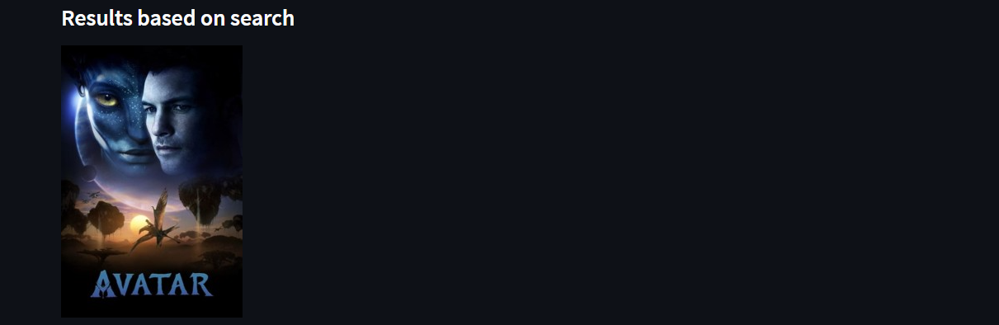
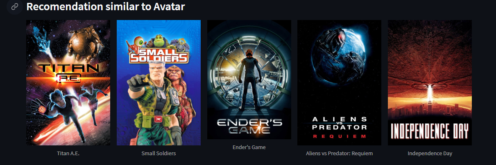
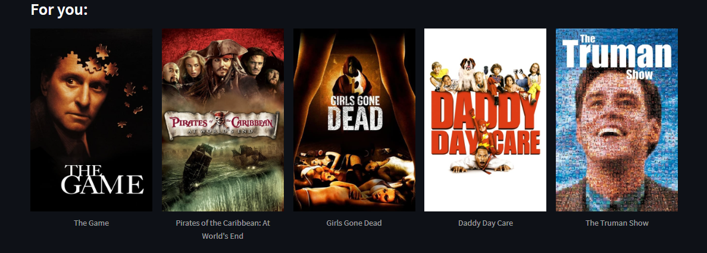
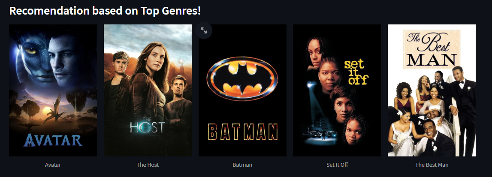
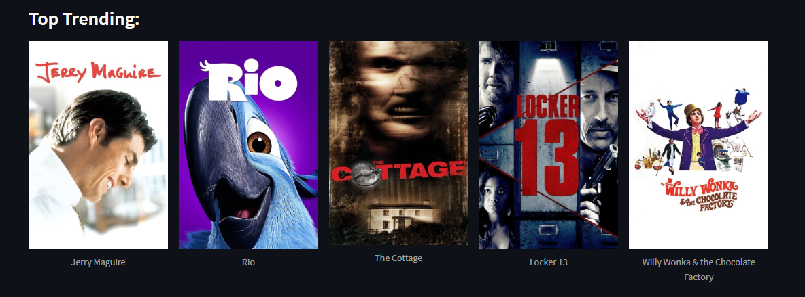
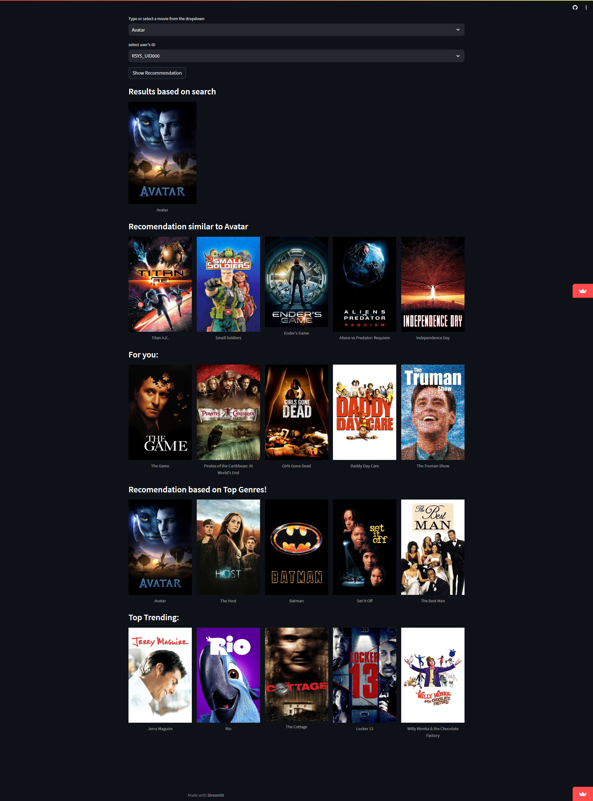

# Movie recommendation using Machine learning
## ML Algorithm used : Cosine similarity

### There are 4 sections in this project to showcase the recommendations
1. Result Based on search.

2. Result based on similarity.

3. Result based on User watch history (Known as FOR YOU section).

4. Top trending based on Genre among Populations watch.

5. Top trending based on Title among population watch.

# This is the Demo page:
### [visit website](https://mov-rec.streamlit.app/)

# Take this project:
## 1. Clone the project and Install Streamlit using:
 ### pip3 install streamlit or pip install streamlit

## 2. Run the app
 ### streamlit run main_app.py

## Boom Go! you are up!!!! 

### Note: All the file's data are available no need to search for anything Also if you want to make any changes in the code, use the notebook for experiments.

# Leave star 🌟
